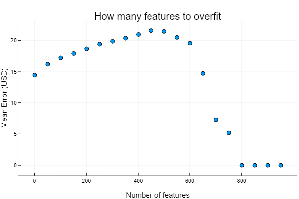

# Introduction

We have looked more closely at our data and taken note of some characteristics of our dataset. We have run preliminary analysis to test the viability of predicting Bitcoin price and shown some early success at modeling the data. We have also established some tests we want to run in the future and other modeling strategies we would like to try.

# Dataset

The dataset is time series data with a total of 1581 samples with 24 features. Each sample represents one day.

There are two primary data sets that we are going to adopt. One consists of historical data on price, market capitalization, and trading volume. Such data possesses a more direct relationship to the bitcoin price. We are going to use the historical price data and the volume as the main predictors for the future price.

The other dataset that can potentially explain the underlying relationship between factors is the Bitcoin trading information data. The parameters that are included in this dataset are bitcoin count, difficulty, hashrate, transactions, and number of unique IP addresses. These parameters can possibly exert an impact on the trading volume as well the marketing capitals.
We are expecting a possible relationship between these factors as well as a relationship to the future Bitcoin price.

In terms of missing data, many of the features are nearly meaningless in early samples because Bitcoin had not been widely recognized and was essentially a private project. It was not being publicly traded so the market price and trading volume were zero, and it was hardly being mined so the mining statistics were insignificant. None of the major existing Bitcoin exchanges existed for roughly the first 3 years of Bitcoin’s existence.

# Feature Analysis

We will examine the interrelationships among the factors of the Bitcoin trading information data, seeking to identify columns with high correlation so as to simplify our data input. From the graph we can see that number of total bitcoins, number of unique addresses, hash_rate, and block size are all closely related. We observed these features to be positively related and potentially logarithmic; future analysis would be needed to assess their exact relationships. Therefore, when we select the predictor factors for the model fitting, we will probably not select all of these four factors. Instead, we will just pick one or two among them.

On the other hand, while examining the relationship between trading volume and the other factors, block size and number of unique addresses seem to behave similarly, thus we should only pick one of them. The others all behave quite differently. Only the total number of bitcoins demonstrates a possible positive correlation with trading volume and hash rate is the most left skewed.

# Preliminary Model Testing

We have created a variety of linear regression models and run three primary tests. From these tests, we have drawn some conclusions that will be useful as we continue to develop our project. As an error metric for our models, we used the magnitude of the difference between the predicted price and the true price, averaged over all days. We chose this error metric because it most closely matches the accuracy measurement that would be used in financial applications of our model.

### Feature selection
The first test we ran was a test to determine which features are the most important. After we narrowed down the feature set by manually eliminating the features that would be redundant or irrelevant, we used our feature analysis to further eliminate those that were highly correlated; in particular, we removed block size. We then created a linear regression model that used yesterday’s value for each feature to predict today’s price. We could then determine the features that had the greatest impact by looking at the magnitudes of the weights in the weight vector. As expected, the price was by far the most significant indicator, but we also established that the hash rate and the number of unique addresses had relatively significant weights as well. This makes sense because these features reflect the number of miners and users, respectively.

### Memorizing the data
The second test we ran was to determine how many features we can safely use without the model simply memorizing the data. For the purposes of the test, in order to use `n` features we would just use historical price data for `n` days. Here is a plot of our results:

As you can see, we can include up to about 400 features before the model starts simply memorizing the data. At 800 features, the model has completely overfit and there is no generalization.

### Optimal number of days
The third test we ran was to determine the optimal number of days of historical data to use. Here is a plot of our results when we used only price as our feature:

The plot indicates that the minimum error is achieved when we use about 14 days of historical data. This matches our plots for other subsets of the features, which all indicated around 2 weeks of historical data to be optimal. From observing plots of price predictions made by the models, the most likely reason the error increases when more days are used is that the model is overfitting to sections of the data that have steep price curves (in order to minimize squared error) but in exchange they are fluctuating a lot on flat sections of the data. This translates to a higher average error by our metric.

# Future Plans

Based on the results, we are looking forward to adding more features and experimenting with feature engineering. In particular, we would like to take some of the more important features we have found and include quadratic or cubic terms for them. Additionally, multiplying features together may help improve our models.

One concern that was mentioned in the peer review is that the political events and laws related to bitcoin can have a huge impact on the trading price and volume but are not reflected in our current data. This was a concern of ours as well. To combat this issue, we may look to add a few indicator features. For example, hard forks of the Bitcoin blockchain are planned in advance, so we can add an feature to our data that is the number of days until an upcoming hard fork, or perhaps simply set the feature to one when there is an impending hard fork and zero otherwise. Similarly, we may want a way to express when legislation is passed on cryptocurrencies. Legislation is rarely a sudden thing, so again we can have an indicator feature that we set manually. Since both hard forks and legislation are relatively rare events and heavily publicized, it should be reasonable to set these features manually for the foreseeable future.

Once we have determined our most optimal model, we would like to use the fitted model to examine other cyber currency and see how well our model generalizes to other cryptocurrencies, and potentially use our model to predict the success of newer cryptocurrencies.
